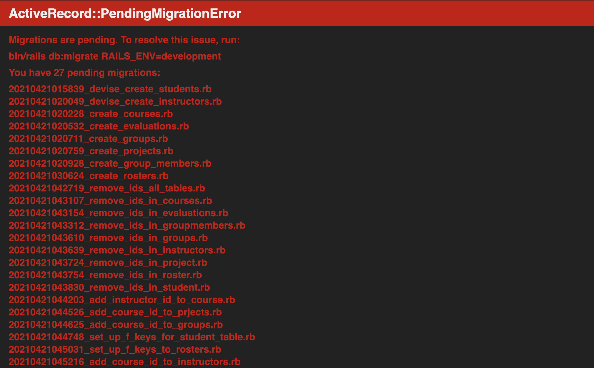
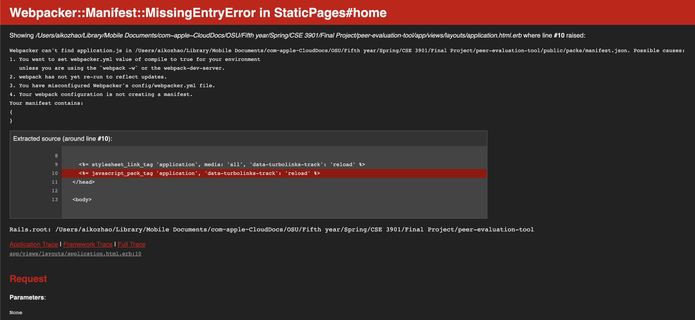

# Peer Evaluation App

### Installations
* **Ruby** and **Rails** must also be installed to run this game.
* For Mac users, you need to install brew too.
  * To install brew, you can find the instruction here:
    * https://docs.brew.sh/Installation
* Before running our peer evaluation web app, you need to install all the gems. On Ubuntu or Windows, run the following commands:
  * ```bundle install``` 
  * ```rails db:migrate```
  * ```rails s```
    * _Note:_ You may need to use the ```sudo``` command to install gems.

### Possible Errors
* PendingMigrationError

 * Solution
  * Simply scroll down and press this button
  * 
* WebpackError
 * If the error you are getting is something related to webpack
 
 * Solution
  * Type the following command in terminal
  * ```bundle exec rails webpacker:install``` 

### Functionality
* We have individual ‘Sign Up’ and ‘Log In’ pages for Students and Instructors.

#### Student Dashboard
* Students are able to view his or her course(s) with the ‘My Courses’ button.
* Students are able to view his or her group(s) with the ‘My Groups’ button.
* Students are able to evaluate his or her group members with the ‘My Groups’ button by selecting their ‘Group Name’ in the table and then clicking the ‘New Evaluation’ button.


#### Instructor Dashboard
* Instructors are able to create a new course and add/remove students to the course with the ‘Create New Course’ button.
* Instructors are able to view his or her courses with the ‘My Courses’ button.
* Instructors are able to assign students to a group with the ‘Create New Group’ button.
* Instructors are able to view his or her students’ evaluations for each other with the ‘View Evaluations’ button.

#### Demo Steps
* A few students should sign up before the instructor signs up.
* Students will need to sign out after the account is created.
* An instructor should sign up next and use the ‘Create New Course’ button to add students to a course. (The instructor can edit the course to remove students as well.)
* An instructor can group students together with the ‘Create New Group’ button.
* Log in as a student and go to ‘My Groups’ to see their group(s) created by the instructor.
* A student can then evaluate each of their group members by selecting their group name and click ‘New Evaluation’.
* The student will choose the ID of the student they wish to evaluate and fill out the form.
* Log in as an instructor and view the student evaluations in the instructor’s course with the ‘View Evaluations’ button.


### Contributions
* Jessica McNeill - Created most the database with Sarah, created the front end of our website, helped Liam with the logic in the MVC. 
* Sarah Zhang - Created most the database with Jessica, helped Liam with the logic in the MVC, created the model, helped restructure our code.
* Aiko Zhao - Created the styling and navigation bar for the website, created the foreign keys for the database, wrote most of the readme.
* Liam Gallagher - Created the logic for our different views, controllers, and extra functionalities, helped restructure our code. 

